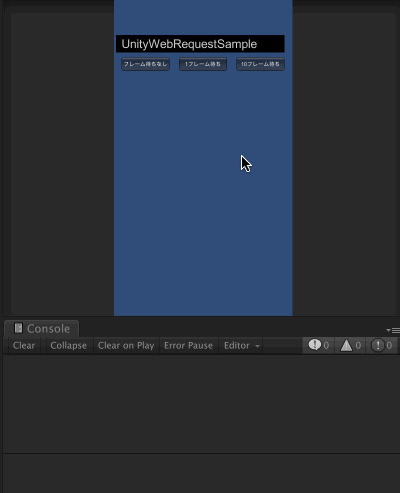
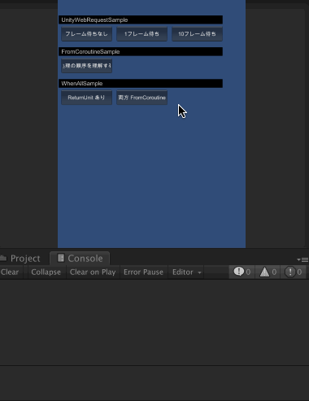

# Unity の UniRx を色々と試すリポジトリ

## UnityWebRequest Sample

### 検証内容

UnityWebRequest の送受信プログラムは非同期実装のため、普通送信したフレームと受信フレームは異なる。

このとき UniRx で送受信を同一ストリーム内で処理を行うと以下のどちらになるか検証した。

* 受信が完了するまでストリームの処理がフレーム遅延する
* ストリームは1フレーム内で完結し、受信処理が失敗する

### 検証結果

ストリームは1フレーム内で完結し、受信処理が失敗した。

同一フレーム内ではリクエストが受け取れずエラーとなった。

一方で受け取りが完了していそうなフレームまで待つことで受信することができた。

### 考察

ストリームの処理がフレーム遅延しないのは、万一ストリーム内の処理が異常に重い場合に描画や物理演算など、後続の処理も遅延させてしまうためアプリ全体がフリーズしてしまうのを防ぐためだと思われる。

## FromCoroutineSample と WhenAllSample

### 検証内容

シンプルにどういう挙動をするかの検証

