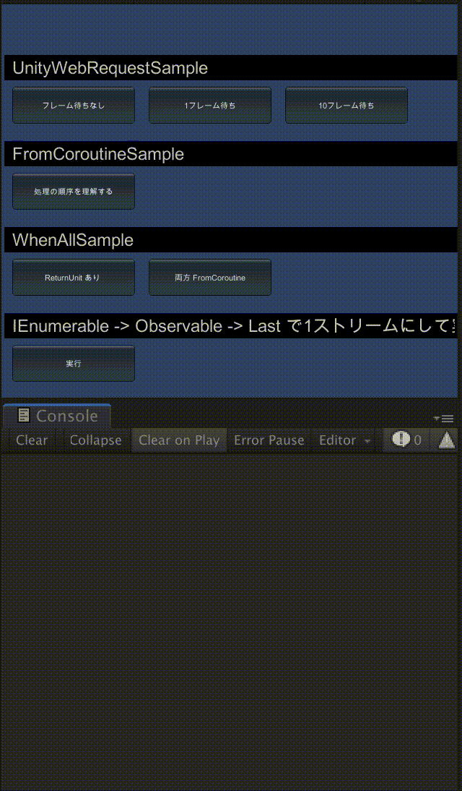

# Unity の UniRx を色々と試すリポジトリ

## UnityWebRequest Sample

### 検証内容

UnityWebRequest の送受信プログラムは非同期実装のため、普通送信したフレームと受信フレームは異なる。

このとき UniRx で送受信を同一ストリーム内で処理を行うと以下のどちらになるか検証した。

* 受信が完了するまでストリームの処理がフレーム遅延する
* ストリームは1フレーム内で完結し、受信処理が失敗する

### 検証結果

ストリームは1フレーム内で完結し、受信処理が失敗した。


同一フレーム内ではリクエストが受け取れずエラーとなった。

一方で受け取りが完了していそうなフレームまで待つことで受信することができた。

### 考察

ストリームの処理がフレーム遅延しないのは、万一ストリーム内の処理が異常に重い場合に描画や物理演算など、後続の処理も遅延させてしまうためアプリ全体がフリーズしてしまうのを防ぐためだと思われる。

## FromCoroutineSample と WhenAllSample

### 検証内容

シンプルにどういう挙動をするかの検証


## IEnumerable を ToObservable して Subscribe する

### 検証内容

繰り返し実行したいストリームがあったときに Repeat とか使えばいいのかなとか勝手に妄想したけどうまく使いこなせなかった。

そこで教えてもらった IEnumerable を ToObservable する処理方法で数回繰り返したい処理を

```csharp
Observable.ReturnUnit()
  .SelectMany(_ => {
    return Observable.ReturnUnit()
      .SelectMany(__ => 実行したい処理)
      .SelectMany(__ => 実行したい処理)
      .SelectMany(__ => 実行したい処理)
  })
  .Subscribe();
```

みたいな書き方をしていた(オペレータは下のようになんでもよい)

```csharp
Observable.ReturnUnit()
  .SelectMany(_ => {
    return Observable.ReturnUnit()
      .Do(__ => 実行したい処理)
      .Do(__ => 実行したい処理)
      .Do(__ => 実行したい処理)
  })
  .Subscribe();
```

これを実行したい回数だけ書かないようにする

```csharp
Observable.ReturnUnit()
  .SelectMany(_ => {
    return RepeatFunc().ToObservable() // IObservable<Unit>
      .SelectMany(__ => 実行したい処理) // IObservable<実行結果の方>
  })
  .Subscribe();
```

と

```csharp
private IEnumerable<Unit> RepeatFunc()
{
  int id = 0;
  int repeatNum = 3;
  while(true)
  {
    id++;
    yield return Unit.Default; // IEnumerator の yield return null みたいだが、繰り返すだけの関数なのでフレームは経過しない
    if (id == repeatNum) { break; }
  }
}
```

として実現した。

実行結果を以下に載せる。


